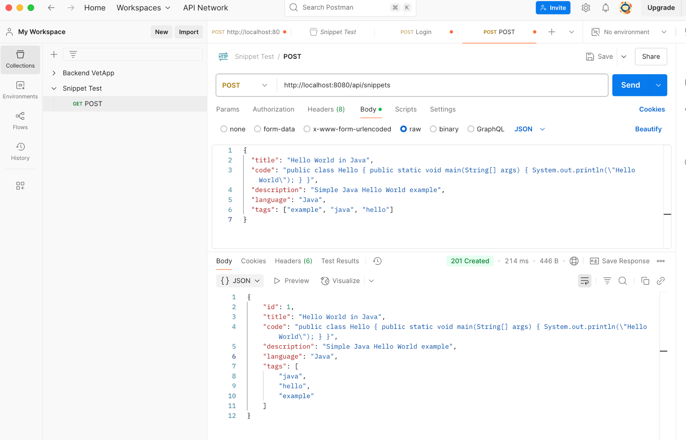
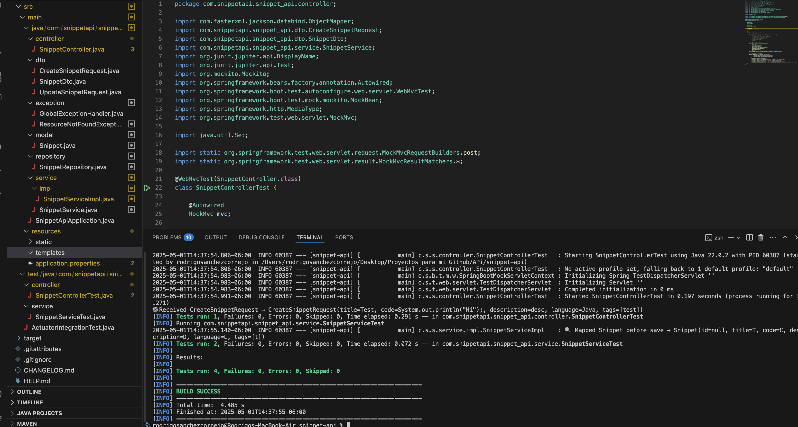

# Snippet API

**Snippet API** is a RESTful microservice built with Spring Boot that allows developers to create, read, update, delete, and search code snippets with metadata such as language, tags, and descriptions.

---

## Screenshots

### Create Snippet Success
This screenshot shows a successful creation of a code snippet via Postman.

### Tests Passing
Unit and integration tests running successfully.

---

## Table of Contents

- [Features](#features)
- [Prerequisites](#prerequisites)
- [Installation](#installation)
- [Configuration](#configuration)
- [Running the Application](#running-the-application)
- [API Endpoints](#api-endpoints)
- [Testing](#testing)
- [Actuator](#actuator)
- [License](#license)

---

## Features

- CRUD operations for code snippets  
- Search by language or tag  
- Input validation with `javax.validation`  
- In-memory H2 database for quick startup  
- Automatic API documentation with Springdoc OpenAPI (Swagger UI)  
- Monitoring endpoints via Spring Boot Actuator  

... (rest of README stays the same as before) ...
